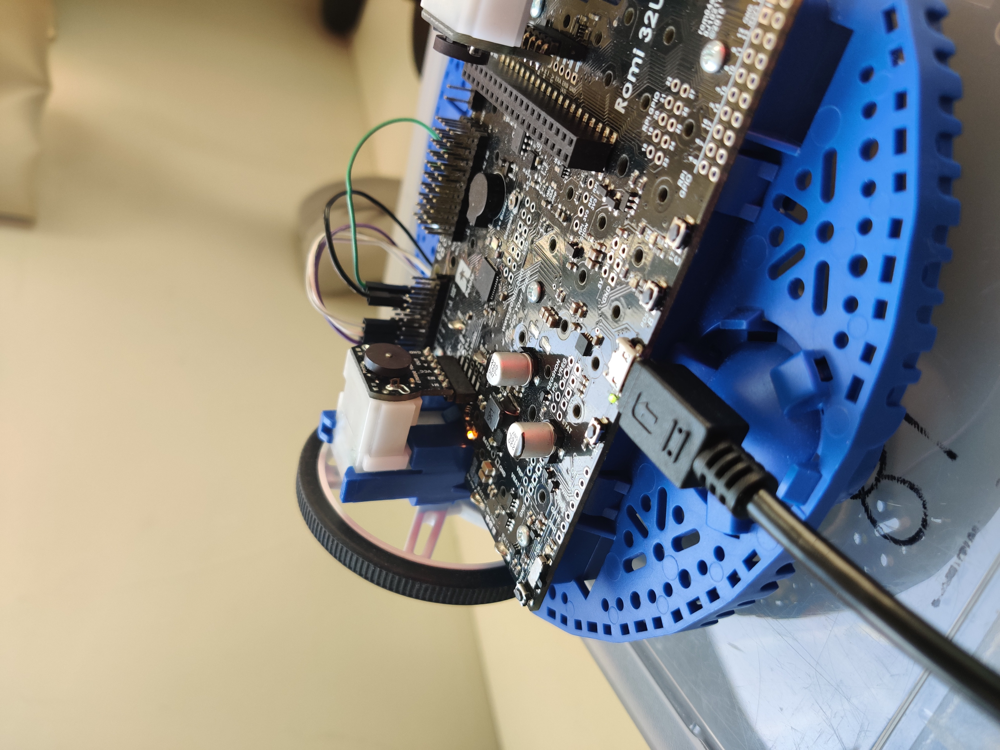
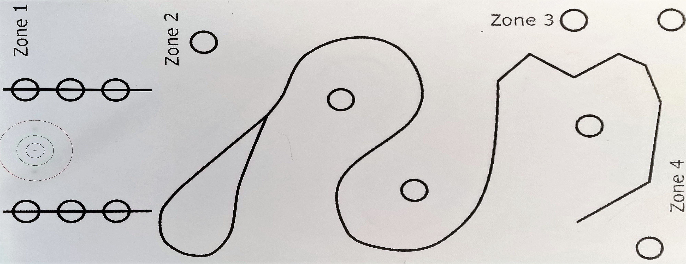

# Line_following_Robot

In this project , a line following mobile robot was designed to navigate along a specific path. 
The path of robot contains series of sharp curves and turns designed to test the agility of the controller. 
Finally , the mobile robot has to return its original location where it was started. 
This kind of scenarios were applicable to track an underground subsea cable of unknown length and return to its destination.

A line sensor was attached to the mobile robot to check for the presence of line. 

The task was segenmented into contains four section as shown below

1.  Main Code : This sections contains the line following program.
2.  Encoder setup.h : In this section, the program was responsible for updating the number of pulses or counts.
3.  PID Controller.h : Contains the PID implementation of the given robot responsible for maintaining the given control variable.
4.  Kinematics.h  : This section implements the kinematics of differential drive mechanism and updates to the main loop. 
5.  Line Sensors.h : In this module , a line constructor class was implemented to get the calibrated reading from the line sensor

The Control board utilised for the entire purpose was ATmega32U4 AVR microcontroller from Microchip (formerly Atmel).

### The following shows the track to follow 

